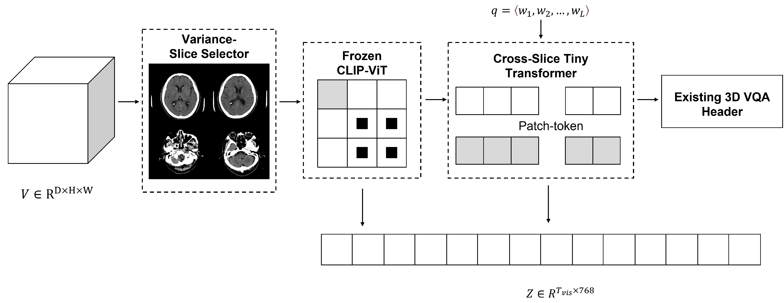

# Slice-Adapter-Lite
Light-weight plug-and-play vision encoder (frozen CLIP + tiny 3-D mixer) for volumetric medical VQA. Implements the paper “Slice-Adapter-Lite: Plug-and-Play 2D Priors for Efficient 3D Medical Visual Question Answering”.

